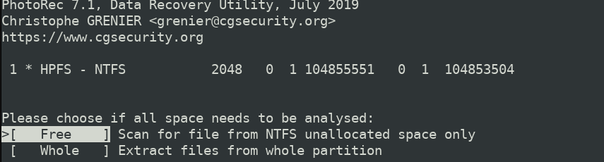
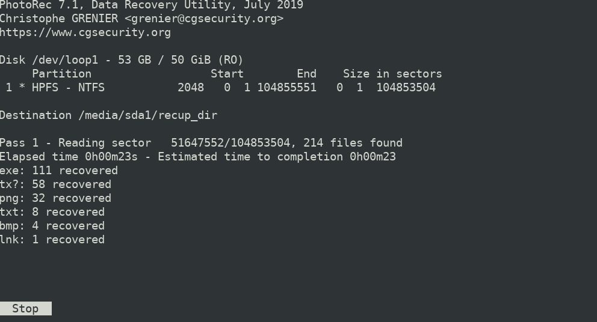
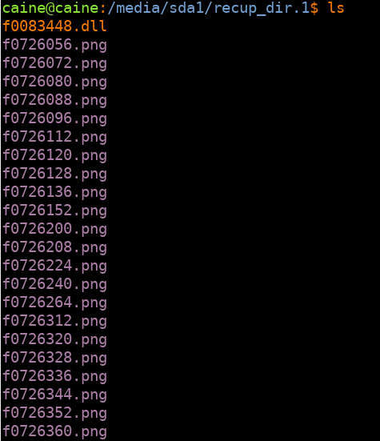

# 🧪 Lab: File Recovery using PhotoRec (Data Carving)

## 🎯 Objective
Recover deleted files from a forensic disk image using signature-based carving techniques without relying on file system metadata (MFT).

## 🧠 Technical Background
Data carving is a forensic recovery technique that extracts files directly from raw disk sectors by identifying file signatures (headers and footers).

Unlike traditional recovery methods, carving:
- Does not depend on MFT or inode entries
- Works even when the file system is corrupted
- Allows recovery from unallocated space
- Is useful when metadata has been intentionally deleted

This technique is commonly used in incident response and forensic investigations involving evidence tampering.

## 🛠 Tools Used
- CAINE Linux
- ewfmount
- losetup
- PhotoRec

## 🔄 Investigation Workflow

### 1️⃣ Mount E01 Image
The forensic `.E01` image was mounted using:
ewfmount image.E01 imagenEWFRaw/

This converts the image into a RAW-accessible format.

### 2️⃣ Associate RAW Image with Loop Device
losetup -fP imagenEWFRaw/ewf1

This allows the system to treat the image as a physical disk (`/dev/loopX`) with accessible partitions.

### 3️⃣ Run PhotoRec
PhotoRec was executed against the selected partition.

Two analysis modes were evaluated:
- **Free** → Scan unallocated space only
- **Whole** → Scan entire partition

For forensic relevance, the **Free** option was selected to focus specifically on deleted artifacts.

## 📊 Results
- 214 files recovered
- Multiple PNG artifacts reconstructed
- Deleted content successfully extracted from unallocated space
- Files exported to designated recovery directory

### 🔎 Evidence – Free Space Analysis

### 📊 Recovery Results

### 📁 Recovered Files

## ⚖️ Forensic Considerations
- Carving may produce fragmented or partially corrupted files
- Original filenames and paths are not preserved
- Hash verification should be performed to maintain evidentiary integrity

## 🔐 SOC / Incident Response Relevance
This type of recovery is critical when:
- An attacker attempts to delete evidence
- Malware artifacts are hidden in unallocated space
- Insider threats remove sensitive data
- File system metadata has been damaged or wiped

Carving provides a recovery method when traditional file system-based analysis fails.

## 📎 Supporting Documentation
Full original lab documentation available

`PhotoRec-Carving-Documentation.pdf`

## 🧩 Lessons Learned

- Signature-based carving remains effective even when file system metadata is unavailable or intentionally removed.
- Selecting the **Free** option reduces noise and focuses the investigation on deleted artifacts.
- Carved files lose contextual metadata (original name, path, timestamps), which limits attribution without further analysis.
- Fragmentation can affect recovery integrity, producing partial or corrupted files.
- Proper forensic workflow requires validating recovered artifacts with hashing to maintain evidentiary integrity.

This lab reinforced the importance of low-level disk analysis when investigating evidence destruction or anti-forensic activity.

