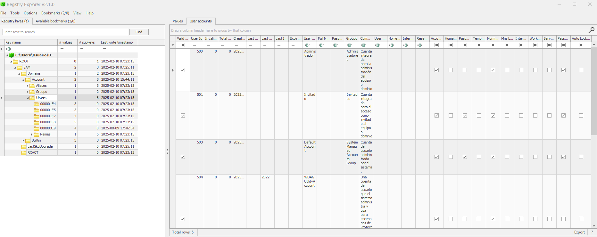
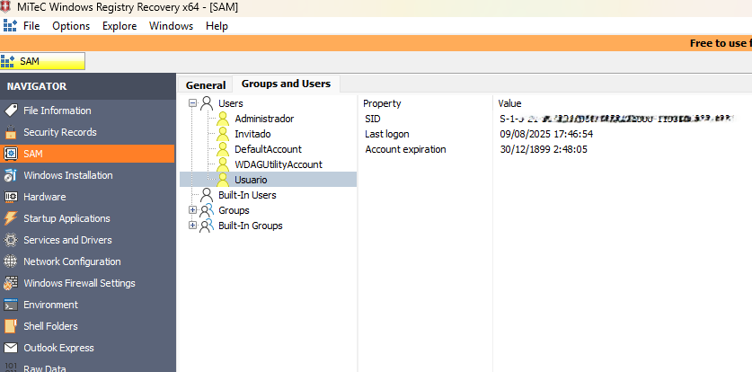

# 🔍 Windows SAM Hive Analysis – DFIR Lab

## 🧪 Lab: Windows SAM Hive Analysis (Account Activity Reconstruction)

---

## 🧾 Scenario

A Windows NTFS system image was examined to analyze local user account activity through registry hive analysis.

The objective was to determine:

- Existing local accounts  
- Account status and configuration  
- Login activity timestamps  
- Potential indicators of persistence or suspicious account usage  

---

## 🎯 Objective

- Extract the SAM hive from a forensic image.
- Identify local user accounts.
- Retrieve RID, SID and group membership.
- Determine last login and password change timestamps.
- Evaluate account configuration (enabled/disabled, expiration, lock status).
- Understand the forensic value of registry-based account artifacts.

---

## 🧠 Technical Background

Windows stores local account information inside the **SAM (Security Account Manager)** hive located at:

Windows\System32\config\SAM

The SAM contains:

- Relative Identifiers (RID)
- Security Identifiers (SID)
- Group membership
- Account flags
- Password metadata (hashed)
- Login-related timestamps

The SAM does not operate alone — meaningful forensic interpretation requires correlation with:

SYSTEM
SECURITY
SOFTWARE
NTUSER.DAT
Event Logs

Registry keys maintain **LastWrite timestamps**, which are critical for timeline reconstruction.

---

## 🛠 Tools Used

- FTK Imager (Hive extraction)
- Registry Explorer (Eric Zimmerman)
- Windows Registry Recovery

---

## 🔄 Investigation Workflow

### 1️⃣ Hive Acquisition

The SAM hive was extracted from:

Windows\System32\config\SAM

Using FTK Imager from a mounted NTFS forensic image.

---

### 2️⃣ Detailed Analysis (Registry Explorer)

The hive was loaded into Registry Explorer to extract:

- Username  
- RID  
- SID  
- Group membership  
- Account flags  
- Last login timestamp  
- Password change timestamp  
- Account expiration  
- Account enabled/disabled state  

---

### 🔎 Registry Explorer – Detailed Account Structure

The SAM hive was analyzed at the RID level under:

SAM\Domains\Account\Users

Each subkey corresponds to a unique RID, enabling detailed account-level forensic reconstruction.

---

### 3️⃣ Timestamp Validation (Windows Registry Recovery)

Windows Registry Recovery was used to:

- Validate account entries  
- Inspect LastWrite (TimeStamp) values  
- Perform quick visual verification of keys  
- Compare metadata interpretation  

---

### 🔎 Windows Registry Recovery – Account Overview

This view provides a clear overview of local accounts, SID values, last logon timestamps and account expiration data extracted from the SAM hive.

---

## 📊 Key Findings

- Local accounts were identifiable via RID/SID.  
- Account group membership was recoverable.  
- Login-related timestamps were present.  
- Account configuration flags provided security posture insight.  
- Registry LastWrite timestamps were accessible for timeline correlation.  

---

## ⚖️ Forensic Considerations

- SAM alone does not confirm interactive logon activity.
- Must be correlated with:
  - Event ID 4624 / 4625 (Security Log)
  - SYSTEM hive (boot correlation)
  - NTUSER.DAT (user profile activity)
- Some account creation timestamps require cross-hive correlation.
- Registry timestamps reflect key modification, not necessarily user login action.

---

## 🔐 SOC & Incident Response Relevance

SAM analysis is critical in:

- Detecting attacker-created local persistence accounts.
- Identifying dormant or hidden administrative accounts.
- Investigating lateral movement preparation.
- Post-compromise account review.
- Insider threat investigations.
- Timeline reconstruction during host-based investigations.

In enterprise environments, unauthorized local account creation is a high-priority alert condition.

---

## 🧩 Lessons Learned

- The SAM hive is a high-value forensic artifact.
- Account metadata alone is insufficient without correlation.
- Registry timestamps are essential for building timelines.
- Tool comparison improves validation accuracy.
- Local account analysis is a core DFIR skillset.
