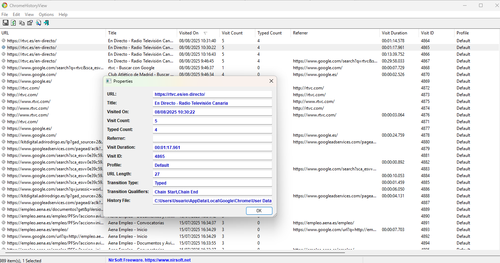
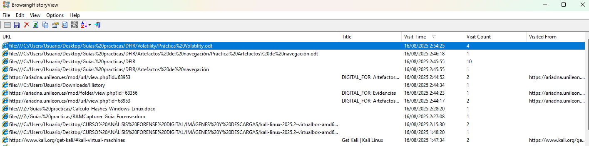

# 🔍 Web Activity Reconstruction – Browser Artifacts Analysis

## 📌 Scenario

A Windows user workstation was analyzed after suspicion of non-authorized web usage during working hours.

The objective of this investigation was to reconstruct browser activity and determine:

- What websites were accessed
- What searches were performed
- Whether files were downloaded or opened
- If suspicious or malicious domains were visited
- If browser activity correlates with local file interaction

---

## 🛠 Tools Used

- Wintriage (evidence acquisition)
- ChromeHistoryView (Nirsoft)
- BrowsingHistoryView (Nirsoft)

---

## 📂 Evidence Source

Browser artifacts extracted from:

- Google Chrome (Chromium-based)
- Windows user profile directory

---

# 🔎 Step 1 – Chrome History Analysis

ChromeHistoryView was used to parse the SQLite `History` database from the user profile.

### 📸 Evidence Screenshot

---

## 📊 Key Fields Examined

- URL
- Title
- Visited On
- Visit Count
- Typed Count
- Referrer
- Visit Duration
- Profile

---

## 🔎 Findings

### 🔹 Repeated Media Website Access

- URL: `https://rtvc.es/en-directo/`
- Multiple visits recorded on **08/08/2025**
- Time range: **09:46 – 10:31**
- Access initiated from Google search query

**Interpretation:**
User actively accessed live streaming media content during working hours.

---

### 🔹 Search Activity Identified

Example query observed:

- "jurassic world rebirth poster imdb"

Typed Count > 0 confirms manual input into the browser address/search bar.

**Interpretation:**
Indicates intentional user search activity rather than automatic redirection.

---

# 🔎 Step 2 – Multi-Browser & Local Access Correlation

BrowsingHistoryView was used to identify:

- Multi-browser activity
- Access to local files via `file://`
- Access to system folders

### 📸 Evidence Screenshot

---

## 📂 Local File Access Observed

Examples:

file:///C:/Users/Usuario/Desktop/Guías/Práctica Volatility.odt
file:///C:/Users/Usuario/Downloads/

**Interpretation:**

- User opened a local `.odt` document from Desktop.
- User accessed Downloads folder.
- Activity occurred within same browsing session timeframe.

This confirms correlation between web browsing and local file interaction.

---

# 🧵 Timeline Reconstruction

| Date       | Time   | Activity |
|------------|--------|----------|
| 08/08/2025 | 09:46  | Google search performed |
| 08/08/2025 | 09:48  | Access to rtvc.es |
| 08/08/2025 | 10:05  | Local document opened (.odt) |
| 08/08/2025 | 10:12  | Downloads folder accessed |

---

# 🚨 Suspicious Activity Assessment

After reviewing the extracted data:

- ❌ No known malicious domains detected
- ❌ No suspicious download URLs observed
- ❌ No phishing indicators identified
- ❌ No abnormal redirection chains

Activity appears consistent with:

- Media streaming
- Online research
- Academic document usage

---

# 🔗 Correlation Opportunities (Advanced DFIR)

This analysis can be expanded by correlating with:

- Prefetch (browser execution confirmation)
- Amcache (downloaded executables validation)
- Windows Event Logs (logon session confirmation)
- Memory dump (if available)

---

# ✅ Conclusion

The reconstructed browsing history demonstrates:

- Repeated access to streaming media
- Manual search activity
- Local document interaction
- No evidence of compromise

No indicators of malicious activity were identified in this dataset.

---

# 📚 Lessons Learned

- Browser artifacts provide strong evidence of user intent.
- Typed Count helps distinguish manual navigation from redirections.
- Referrer field assists in reconstructing navigation chains.
- `file://` entries are highly valuable for correlating browser and local file activity.
- Artifact correlation significantly strengthens forensic conclusions.

---

# 🎯 DFIR Value

This lab demonstrates:

- Browser artifact extraction
- Behavioral reconstruction
- Timeline building
- Analytical reasoning
- Suspicion validation methodology
