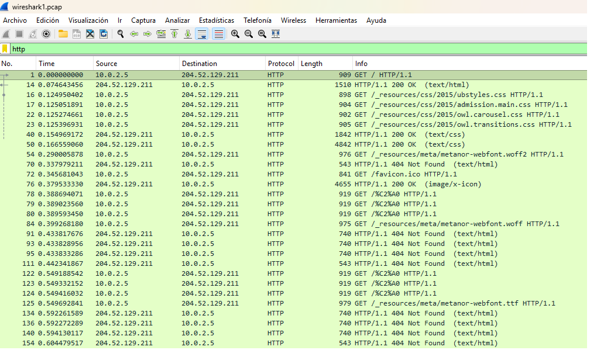
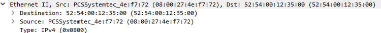

# 🌐 Network Traffic Investigation – HTTP Session Analysis

## 📌 Scenario

A packet capture (PCAP) file was obtained from a workstation suspected of unauthorized web activity.

The objective of this investigation was to determine:

- Which website the user accessed
- The internal IP address of the workstation
- The external destination server IP
- The MAC address of the user device
- Whether any suspicious activity was detected

---

## 🛠 Tools Used

- Wireshark
- PCAP network capture file
- OUI Lookup (MAC vendor identification)

---

# 🔎 Step 1 – Isolate HTTP Traffic

Display filter applied:

http

### 📸 Evidence – HTTP Filter Applied

This filter isolates all HTTP communications within the capture.

From the filtered traffic we observe:

- Source IP: `10.0.2.5`
- Destination IP: `204.52.129.211`
- Multiple `GET` requests
- Server responses including `HTTP/1.1 200 OK` and `404 Not Found`

The observed behavior is consistent with normal web asset loading.

---

# 🔎 Step 2 – Identify Accessed Website

A HTTP GET request was inspected.

Within the packet details:

GET /_resources/css/2015/admission.main.css HTTP/1.1
Host: www.ubalt.edu

### 📸 Evidence – Host Header Identification

### 📌 Domain Identified

- `www.ubalt.edu`
- University of Baltimore (educational institution)

### Interpretation

The Host header confirms the exact domain being accessed.

This is critical in HTTP/1.1 because multiple domains can share the same IP address (virtual hosting).

Additionally observed:

- User-Agent indicates Linux x86_64 system running Firefox
- Referrer shows navigation from the main site page

This suggests legitimate browsing behavior.

---

# 🔎 Step 3 – Identify MAC Address

Within the packet details, the Ethernet II layer was examined.

### 📸 Evidence – Ethernet II Layer

From the Ethernet header:

- Source MAC: `08:00:27:4e:f7:72`

### OUI Analysis

The prefix `08:00:27` corresponds to **Oracle VirtualBox**.

### Interpretation

The traffic originated from a virtualized environment, consistent with lab or analysis setup.

---

# 📊 Summary of Identified Artifacts

| Artifact Type        | Value                     |
|----------------------|--------------------------|
| Accessed Domain      | www.ubalt.edu            |
| Internal IP          | 10.0.2.5                 |
| External IP          | 204.52.129.211           |
| MAC Address          | 08:00:27:4e:f7:72        |
| MAC Vendor           | Oracle VirtualBox        |
| Protocol             | HTTP                     |

---

# 🚨 Suspicious Activity Assessment

After reviewing the network traffic:

- No malicious domains detected
- No suspicious HTTP payloads observed
- No abnormal TCP behavior identified
- HTTP responses consistent with standard web browsing

The traffic appears legitimate.

---

# ✅ Conclusion

The PCAP analysis confirms:

- The user accessed the University of Baltimore website.
- The communication originated from a private internal IP address.
- The MAC address indicates a VirtualBox virtual machine.
- No indicators of compromise were detected.

The activity is consistent with normal web browsing behavior.

---

# 📚 Lessons Learned

- The HTTP Host header is essential for domain identification.
- MAC OUI analysis can reveal virtualization environments.
- Even basic HTTP captures provide strong attribution evidence.
- Structured methodology improves clarity in network forensic investigations.

---

# 🎯 DFIR / SOC Value

This lab demonstrates:

- PCAP traffic analysis
- Protocol layer interpretation (Ethernet → IP → TCP → HTTP)
- Domain attribution via Host header
- MAC vendor identification
- Structured investigative reporting
