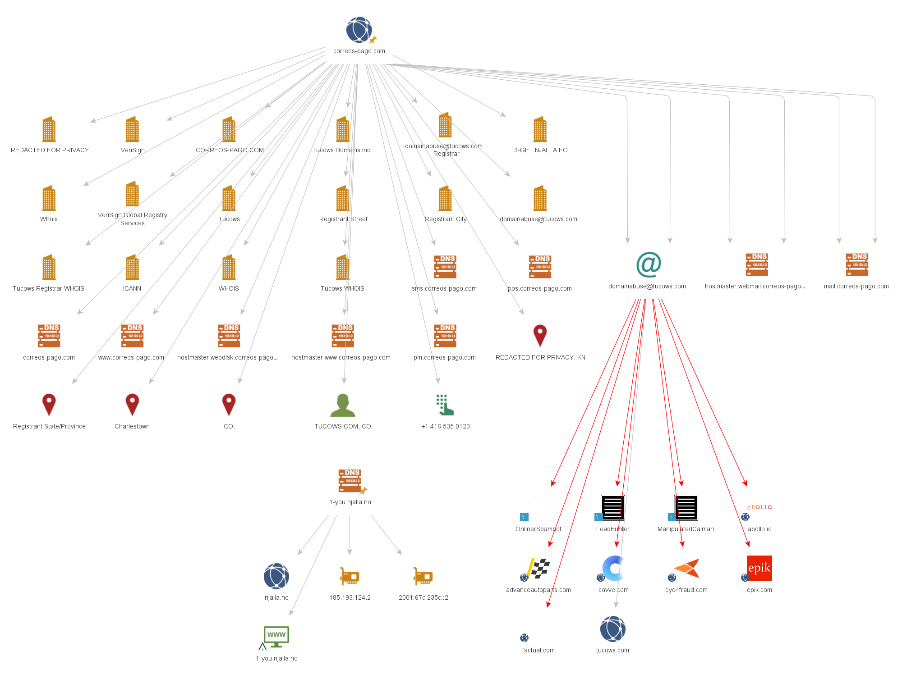

# 🔍 Maltego Phishing Analysis — Suplantación de Correos España

> **Categoría:** OSINT · Threat Intelligence · Blue Team  
> **Herramienta principal:** Maltego Graph Desktop 4.11.2  
> **Fecha:** Abril 2026  
> **Nivel:** Intermedio

---

## 📋 Descripción del ejercicio

Análisis OSINT completo de una campaña de phishing activa que suplantaba la identidad de **Correos España**, utilizando Maltego como herramienta principal de mapeo de infraestructura.

El objetivo fue identificar, documentar y comparar la infraestructura maliciosa frente a la legítima, aplicando técnicas defensivas reales de ciberinteligencia.

> ⚠️ Todo el análisis se realizó exclusivamente sobre fuentes públicas (OSINT). No se accedió a ningún sistema sin autorización. Uso exclusivamente educativo.

---

## 🎯 Dominio analizado

| Campo | Valor |
|---|---|
| **Dominio malicioso** | `correos-pago.com` |
| **Dominio legítimo (referencia)** | `correos.es` |
| **Fecha de registro** | 24/12/2025 (Nochebuena) |
| **Estado actual** | Inactivo — campaña finalizada |

---

## 🗺️ Grafo de infraestructura (Maltego)



> El grafo muestra la infraestructura completa del dominio malicioso: subdominios activos, nameservers de Njalla, datos WHOIS y filtraciones asociadas (flechas rojas = Have I Been Pwned).

---

## 🚨 Hallazgos principales

### Triple capa de anonimato
- **Registrante:** `REDACTED FOR PRIVACY` vía Tiered Access
- **DNS anónimo:** Njalla (`.no` / `.in` / `.fo`) — propietario legal es el propio Njalla
- **Jurisdicción:** Saint Kitts y Nevis (KN) — escasa cooperación judicial internacional

### Infraestructura identificada
| Subdominio | Función |
|---|---|
| `sms.correos-pago.com` | ⚠️ Envío masivo de SMS fraudulentos |
| `mail.correos-pago.com` | Servidor de correo propio |
| `pm.correos-pago.com` | Panel de control probable |
| `www.correos-pago.com` | Web principal de phishing |

### Técnicas de evasión detectadas
- Registro en festivo (Nochebuena) para evitar detección temprana
- `clientTransferProhibited` + `clientUpdateProhibited` desde el primer día
- Teléfono de contacto canadiense (+1 416) para un dominio que simula ser español

---

## ⚖️ Comparativa legítimo vs fraudulento

| Indicador | `correos.es` ✅ | `correos-pago.com` ❌ |
|---|---|---|
| TLD | `.es` oficial | `.com` genérico |
| Registrante | Correos y Telégrafos S.A. | REDACTED |
| País | España | Saint Kitts y Nevis |
| DNS | Propios de Correos | Njalla (anónimo) |
| Subdominio SMS | No existe | `sms.correos-pago.com` |
| Antigüedad | Décadas | Registrado en festivo 2025 |

---

## 🔄 Ciclo de vida de la campaña

```
24/12/2025  →  Registro del dominio (Nochebuena)
Dic–Ene     →  Configuración de infraestructura
Marzo 2026  →  Lanzamiento campaña SMS masiva (+120 dominios activos en España)
Mar–Abr     →  Recolección de credenciales bancarias
Abril 2026  →  Desactivación del servidor (ERR_CONNECTION_TIMED_OUT)
```

---

## 🛠️ Herramientas utilizadas

| Herramienta | Uso | Coste |
|---|---|---|
| [Maltego 4.11.2](https://www.maltego.com) | Mapeo de infraestructura | Freemium |
| [Have I Been Pwned](https://haveibeenpwned.com) | Detección de filtraciones | Gratuito |
| [VirusTotal](https://virustotal.com) | Análisis de reputación | Gratuito |
| [WHOIS / who.is](https://who.is) | Datos de registro | Gratuito |
| [Shodan](https://shodan.io) | Puertos y servicios expuestos | Freemium |
| [ViewDNS](https://viewdns.info) | Reverse IP lookup | Gratuito |

---

## 📁 Archivos del repositorio

```
maltego-phishing-analysis/
    ├── README.md                         ← Este archivo
    ├── informe_phishing_correos.docx     ← Informe completo del análisis
    └── phising.png                       ← Grafo de Maltego exportado
```

---

## 🧠 Aprendizajes para Blue Team

- Un solo dominio puede revelar toda la red de un actor amenaza
- La fecha de registro y el proveedor DNS son indicadores clave de intención maliciosa
- Maltego permite mapear infraestructura maliciosa de forma completamente pasiva y legal
- Comparar infraestructura legítima vs fraudulenta es fundamental para detectar suplantaciones
- Las campañas de phishing profesionales tienen un ciclo de vida corto y calculado

---

## 📌 Recursos relacionados

- 📄 [Informe completo en este repositorio](informe_phishing_correos.pdf)
- 🔗 [Post de LinkedIn sobre este análisis](https://www.linkedin.com/posts/sergiolopez-blueam_ciberseguridad-blueteam-osint-activity-7451036218945028096-5e6R?utm_source=share&utm_medium=member_desktop&rcm=ACoAAEGrA7wBLUN49Pl16SfyLy1yemk40bxESjc)
- 📚 [INCIBE — Reporte de phishing (017)](https://www.incibe.es/linea-de-ayuda-en-ciberseguridad)

---

*Ejercicio práctico de ciberinteligencia — Uso exclusivamente educativo*
